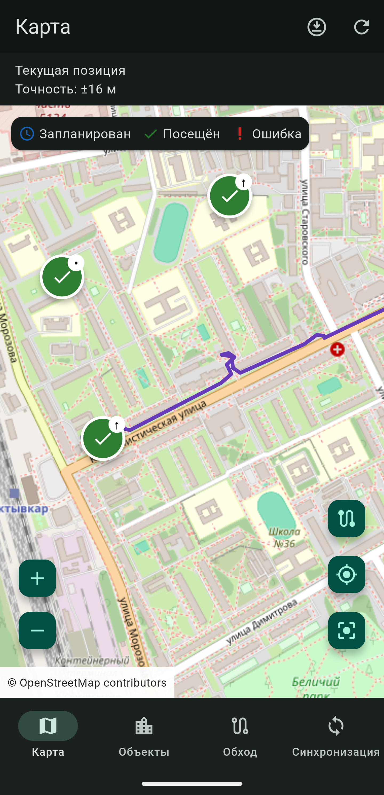
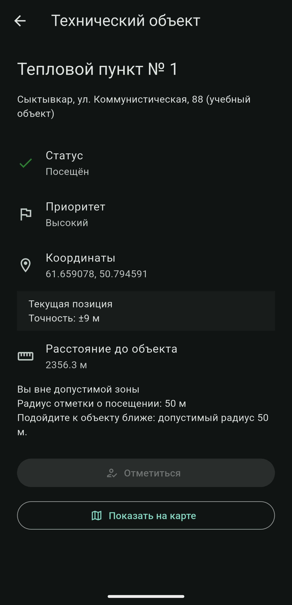
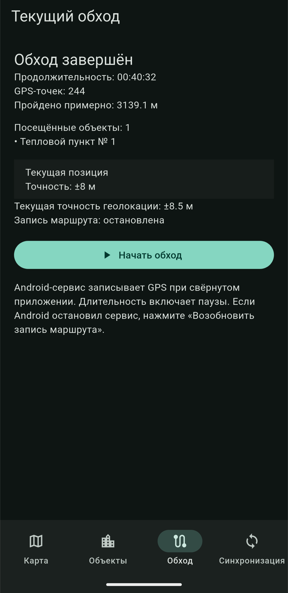
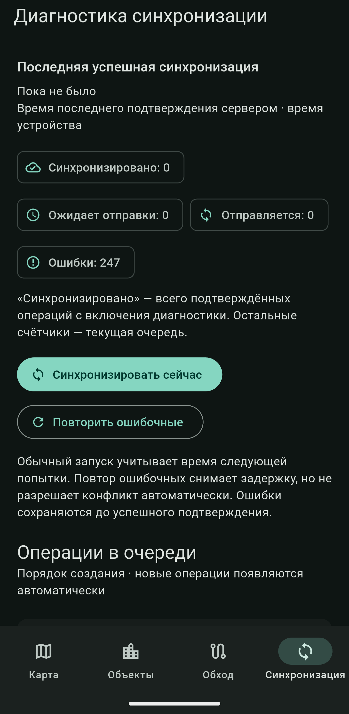

# Полевой инспектор

Android-приложение на Flutter для выездного сотрудника: найти технический объект,
начать обход, подтвердить посещение по GPS и сохранить пройденный маршрут.
Объекты, посещения и очередь изменений доступны без интернета; отправка на сервер
выполняется отдельно от работы пользователя.

Учебный проект исследует локальные транзакции, потерю сети и подтверждений,
конфликты версий, жизненный цикл Android и сохранение GPS без интерфейса Flutter.
Минимальный сервер ASP.NET Core служит тестовым стендом.

## Возможности

| Возможность | Реализация |
| --- | --- |
| **OpenStreetMap** | flutter_map: статусы и приоритеты объектов, полигоны, GPS, линия маршрута, границы и возврат камеры к объектам или обходу |
| **GPS** | Текущая и последняя известная позиция, точность, поток обновлений, отказ в разрешении, выключенная геолокация и ошибки |
| **Отметка о посещении** | Расстояние по формуле Haversine; радиус 50 м и точность не хуже 50 м; посещение, очередь и статус объекта сохраняются атомарно |
| **Работа без интернета** | Drift/SQLite — источник состояния экранов; реактивные потоки, начальные данные, схема v6 и проверяемые миграции |
| **SyncEngine** | Последовательная очередь, повторы с задержкой, идемпотентность, восстановление, конфликты и диагностика |
| **Фоновая запись маршрута** | Foreground Service на Kotlin, постоянное уведомление, независимая входящая очередь SQLite |
| **WorkManager** | Отложенная отправка очереди при наличии сети через тот же SyncEngine |
| **Геозона** | CircularGeofence: внутри, приближение, снаружи; пороги по умолчанию 50/150 м |
| **Точка в полигоне** | Алгоритм Ray Casting для простых локальных полигонов; граница считается внутренней; контуры хранятся локально и отображаются на карте |
| **Фильтрация GPS** | Отбрасывание неточных координат, малого движения, неверного времени и нереалистичной расчётной скорости |
| **Обход** | Начало и завершение, длительность, точки, расстояние, посещённые объекты, восстановление активного обхода |
| **Группировка маркеров** | Собственная сетка Web Mercator O(n), кэширование слоёв; тест на 500 локальных объектах |
| **Офлайн-карты** | Подготовленный растровый пакет, сохранённые тайлы и загрузка через сеть при отсутствии локального покрытия |

Автоматической отметки о посещении и построения оптимального маршрута нет.
Круговая зона и проверка точки в полигоне — отдельные геометрические инструменты;
полигоны не подменяют проверку радиуса отметки.

## Архитектура

Код организован по функциональным модулям. Чтение и локальные изменения:

~~~text
Интерфейс → Riverpod → репозиторий → Drift / локальная БД
~~~

Исходящая синхронизация:

~~~text
SyncEngine → очередь синхронизации → REST API
~~~

Очередь хранится в Drift, HTTP выполняет SyncProcessor. Ответ сервера сначала
фиксируется в SQLite; экраны получают обновления через поток локальной БД.

~~~mermaid
flowchart TB
    subgraph Mobile[Приложение Flutter]
        UI[Интерфейс] --> RP[Провайдеры и контроллеры Riverpod]
        RP --> Repo[Репозитории]
        Repo --> DB[(Drift / локальная БД)]
        DB -. Потоки изменений .-> RP
        Trigger[Жизненный цикл / ручной запуск] --> Engine[SyncEngine]
        Worker[Фоновый обработчик WorkManager] --> Engine
        Engine --> Queue[Очередь в Drift]
        Queue -->|Захват и отправка через SyncProcessor| API[REST API]
        API -->|Подтверждение или ошибка| Engine
        Engine -->|Результат одной транзакцией| DB
    end
    subgraph Native[Запись маршрута средствами Android]
        Bridge[Адаптер NativeTracking] <-->|MethodChannel| Service[Foreground Service на Kotlin]
        Service --> Location[Android Location APIs / FusedLocationProviderClient]
        Location -->|Обратный вызов через GpsFilter| Inbox[(Входящая очередь SQLite)]
        Inbox -->|readPoints через канал| Importer[NativeTrackImporter]
        Importer -->|Сначала фиксация| Repo
        Importer -. Подтверждение после фиксации .-> Inbox
    end
    RP --> Bridge
    API --> Server[(EF Core / серверная SQLite)]
~~~

Управление сервисом и перенос точек не зависят от жизненного цикла виджетов.
При отсутствии Flutter сервис пишет в собственную входящую очередь.

~~~text
lib/
  app/                       # MaterialApp.router, go_router, тема
  core/
    database/                # Drift, служебные таблицы, миграции
    geometry/                # Haversine, геозоны, Ray Casting
    location/                # LocationService, geolocator, платформенный канал
    network/                 # Dio и преобразование сетевых ошибок
    sync/                    # движок, обработчик, повторы, блокировка, конфликты
    permissions/ utils/ widgets/
  features/
    map/ objects/ route/ visits/ tracking/ sync/
      data/ domain/ presentation/  # слои по потребностям модуля
android/app/src/main/kotlin/  # сервис Android, хранилище, фильтр GPS
backend/                     # ASP.NET Core API и HTTP smoke-тесты
test/                        # модульные, интеграционные, виджетные и HTTP-тесты
~~~

Интерфейс работает с доменными сущностями и состоянием Riverpod. SQL, DTO Dio и
Geolocator.Position остаются за границами экранов. Провайдеры собирают зависимости;
GetIt/BLoC и дополнительный DI-контейнер не используются.

## Работа без интернета

**Локальная БД — единый источник состояния.** Карта, список и детали всегда
читают один поток репозитория, независимо от доступности API.

Отметка о посещении выполняет одну транзакцию:

~~~text
BEGIN
  INSERT visit (syncStatus = pending)
  INSERT sync_queue operation
  UPDATE object SET status = visited
COMMIT
~~~

После фиксации интерфейс сразу показывает посещение. Если вставка очереди не
удалась, откатывается и посещение: сохранённого изменения без задания на
синхронизацию не возникает. Сеть не вызывается. Повторное открытие приложения
восстанавливает посещение, статус и очередь из SQLite.

Ручное обновление идёт через API, DTO, репозиторий, транзакцию Drift и поток БД.
Несинхронизированные изменения защищены; известная serverVersion не откатывается
старым ответом. При отсутствии сети, превышении времени ожидания или ошибке 500
показывается SnackBar, а локальные данные остаются. Пустая БД получает пять
учебных объектов; доступный сервер для открытия приложения не нужен.

Бизнес-БД содержит objects, routes, route_objects, visits, location_points,
sync_queue, sync_conflicts, app_metadata. Снимки схем v1–v6 и тесты миграций
хранятся в репозитории. Ради обновления схемы несинхронизированная БД не удаляется.

## SyncEngine

Движок не зависит от интерфейса. Его используют открытое приложение, экран
диагностики и WorkManager. Запуск происходит при старте, возврате в приложение,
по таймеру и вручную на вкладке «Синхронизация».

| Механизм | Поведение |
| --- | --- |
| Очередь | Последовательная обработка; повтор или конфликт блокирует последующие операции своей сущности |
| Сохранённый захват | До HTTP транзакционно фиксируются operationId, неизменяемые данные запроса и syncing |
| Успех | Проверенное подтверждение обновляет syncStatus/serverVersion и удаляет операцию одной транзакцией |
| Повтор | attemptCount увеличивается; lastError и nextRetryAt сохраняются. Сетевые ошибки, превышение времени и 5xx повторяются автоматически |
| Экспоненциальная задержка | 5, 10, 20, 40… секунд, максимум 15 минут. Для 4xx автоматического повтора нет; 409 требует решения конфликта |
| Идемпотентность | Постоянный идентификатор и неизменный запрос при повторе; сервер исключает дубликаты событий, а для PATCH сохраняет подтверждения |
| Восстановление | Прерванные syncing возвращаются в pending с прежним запросом; failed сохраняют задержку после перезапуска |
| Параллельные запуски | Один проход на изолят и блокировка SQLite между интерфейсом и фоновым обработчиком; проверка владельца защищает от запоздалых ответов |

Доставка выполняется **не менее одного раза с идемпотентным применением**.
Потеря ответа после фиксации на сервере приводит к безопасному повтору запроса.

**Конфликты.** PATCH с локальной версией 4 против серверной 5 получает 409.
В sync_conflicts сохраняются запрос, локальные и серверные поля. Можно явно
принять серверную версию объекта или повторить последние локальные поля на новой
базе. Посещение — неизменяемый факт; автоматически перезаписывать его нельзя.
История решений сохраняется, кнопка повтора не обходит конфликт.

**Объединение очереди.** Правки до первой отправки объединяются в непрерывном
неотправленном хвосте. Уже захваченная A сохраняет запрос, новая B ждёт.
Подтверждение A обновляет версию, не затирая B. Для посещений и GPS-точек
объединение не применяется.

[Движок синхронизации](lib/core/sync/README.md) ·
[Конфликты и сценарий A → B](lib/core/sync/CONFLICTS.md)

## Фоновая работа

| | Foreground Service | WorkManager |
| --- | --- | --- |
| Задача | Продолжительный сбор GPS | Отложенная отправка ожидающих операций и повторов |
| Реализация | Kotlin, FusedLocationProviderClient | Flutter без интерфейса, общий SyncEngine |
| Хранение | Отдельная входящая очередь SQLite | Существующая sync_queue в Drift |
| Запуск | Пользователь начинает обход в видимом приложении | Единственная периодическая задача при наличии сети и достаточного заряда |
| Интерфейс | Постоянное уведомление со счётчиком | Виджеты и Activity не требуются |

Сервис не зависит от FlutterEngine. Импортёр читает точки через MethodChannel,
фиксирует их вместе с исходящей очередью в Drift и только затем подтверждает
перенос. Постоянные идентификаторы делают повторный импорт безопасным.

**Ограничение MVP:** WorkManager не импортирует платформенную очередь и не
занимается GPS. Точки, накопленные без Flutter, отправляются после импорта при
возвращении в приложение. Сбор координат продолжает работать независимо.

Период WorkManager — 15 минут, но это не точное расписание. Foreground Service
не гарантирует непрерывность после принудительной остановки, перезагрузки или
ограничений производителя. Сервис геолокации запускается из видимой Activity
с необходимыми разрешениями и типом.
[Требования Android](https://developer.android.com/develop/background-work/services/fgs/service-types#location).

[Запись маршрута и ADB](lib/features/tracking/README.md) ·
[Фоновая синхронизация](lib/core/sync/BACKGROUND_SYNC.md)

## Фильтрация GPS

LocationPointFilter — самостоятельный сервис предметной области на Dart.
GpsFilter на Kotlin применяет те же правила перед записью платформенной очереди.

| Проверка | Решение |
| --- | --- |
| Точность хуже 50 м | Отбросить точку |
| До предыдущей принятой точки менее 5 м | Отбросить шум или малое перемещение |
| Расчётная скорость (расстояние по Haversine / интервал времени) больше 15 м/с | Отбросить нереалистичный скачок для профиля обхода |
| Некорректные координаты, точность, скорость или неположительный интервал | Отбросить точку |

Сообщённая GPS скорость хранится, но не доказывает правдоподобность движения.
Сравнение идёт с последней **принятой** точкой. Разрывы хранятся сегментами,
чтобы линия маршрута не соединяла неизвестные промежутки. Пороги относятся к MVP,
а не к универсальной модели движения транспорта.

## Офлайн-карты

**Локальные бизнес-данные и сохранённая подложка карты — разные механизмы.**
Без подложки объекты, посещения и маршрут остаются в Drift.

Регион MVP: район ЖД вокзала Сыктывкара, 40 PNG-тайлов,
масштаб 13–16. Python-утилита преобразует разрешённый растровый MBTiles в
JSON/PNG-пакет. Приложение проверяет полноту, формат и лимиты и устанавливает
его в отдельный каталог.

Сохранённый тайл имеет приоритет; при его отсутствии карта OSM загружается через
сеть. Режим «Только сохранённая карта» запрещает сетевые запросы. Без сети вне
покрытия подложка может быть пустой. Лимиты: 12 МиБ JSON и 8 МиБ PNG.
Готовый пакет [field-region.json](tools/offline_maps/output/field-region.json)
включён в репозиторий. Он подготовлен из данных OSM с оформлением в QGIS.
Исходные PBF и MBTiles для запуска не нужны. Пакет не встроен в APK:
его нужно один раз загрузить через отдельный статический сервер.
На карте отображается одна подпись «© OpenStreetMap contributors».

Массовое скачивание публичных тайлов OSM не реализовано и запрещено
[политикой tile.openstreetmap.org](https://operations.osmfoundation.org/policies/tiles/).
[Подготовка пакета и проверка](docs/OFFLINE_MAPS.md).

## Технологии

| Область | Технологии |
| --- | --- |
| Мобильное приложение | Flutter 3.47.5 / Dart 3.13.4, только Android |
| Состояние и навигация | Riverpod, go_router |
| Хранение и модели | Drift 2.35.0, SQLite, Freezed, json_serializable, build_runner |
| Сеть и карты | Dio, flutter_map, OpenStreetMap, latlong2 |
| Геолокация и фоновые задачи | geolocator, workmanager, Kotlin, MethodChannel, FusedLocationProviderClient |
| Сервер | ASP.NET Core Web API, .NET 10, EF Core SQLite, Swagger |
| Проверки | flutter_test, Kotlin JUnit, HTTP smoke-тесты, Python unittest, GitHub Actions |

Группировка и геометрические алгоритмы реализованы без дополнительных пакетов.
Версии зависимостей зафиксированы в файлах блокировки.

## Снимки экранов

Снимки приложения на Android в тёмной теме.

| Карта | Объект | Текущий обход | Синхронизация |
| --- | --- | --- | --- |
|  |  |  |  |
| Объекты, точность GPS и маршрут | Статус, приоритет и условия отметки | Итоги завершённого обхода | Счётчики очереди и повтор ошибок |

[Описание снимков экранов](docs/screenshots/README.md).

## Запуск

Учебные объекты и офлайн-регион расположены в районе ЖД вокзала Сыктывкара.
Объекты и границы условные. Приложение открывается без API: объекты, отметки
и обходы сохраняются локально. Для синхронизации нужен API на порту 5080,
для первоначальной загрузки подложки — отдельный сервер пакета на порту 8090.

Нужны Flutter 3.47.5 (Dart 3.13.4), Android SDK и JDK 17.
Для API нужен .NET 10 SDK; для сервера пакета — Python 3,
для smoke-тестов — PowerShell 7.5+. GPS требует устройства или эмулятора
с Google Play Services / Google APIs.
Проверьте `python --version`: команда должна вывести версию интерпретатора.
Если выводится только `Python`, это может быть псевдоним Windows;
установите Python 3 или используйте полный путь к действительному `python.exe`.

При обновлении старой БД учебные адреса и координаты переносятся без её очистки.
Пользовательская геометрия и объекты с операциями в очереди не перезаписываются.
Посещения и история GPS сохраняют исходные координаты. Сервер обновляет начальные
данные при перезапуске; после этого обновите объекты кнопкой в приложении.

### Flutter

~~~sh
git clone https://github.com/TrypikRU/workingwithmaps.git
cd workingwithmaps
flutter pub get
dart run build_runner build
flutter devices
flutter run --debug -d <android-device-id> --dart-define=API_BASE_URL=http://10.0.2.2:5080/ --dart-define=OFFLINE_MAP_PACK_URL=http://10.0.2.2:8090/field-region.json
~~~

Команда выше предназначена для эмулятора; сначала запустите серверы ниже.
`API_BASE_URL` и `OFFLINE_MAP_PACK_URL` независимы и по умолчанию используют
адрес компьютера из эмулятора (`10.0.2.2`). Без сервера доступны
начальные данные, отметки и обход. Для загрузки объектов нажмите кнопку обновления
на карте или в списке. Имя пакета: workingwithmaps.
Идентификатор Android: com.klochkov.workingwithmaps.

Сборка использует AGP 9.0.1, Gradle 9.1 и встроенный Kotlin
(android.builtInKotlin=true). Kotlin 2.3.20 объявлен с apply false для обновления
компилятора относительно Kotlin 2.2.10 в AGP 9.0. Отдельный плагин Kotlin Android
к приложению не применяется; android.newDsl=false сохраняет совместимость DSL.

Flutter 3.47.5 может предупреждать о KGP для workmanager_android 0.10.9:
проверка ищет apply plugin регулярным выражением, включая условную ветку старых
сборок. Со встроенным Kotlin эта ветка не выполняется. Не исправляйте это
редактированием Pub Cache или отключением проверки зависимостей; после обновлений
Flutter/WorkManager повторно проверяйте Android-сборку.

### Сервер ASP.NET Core

В другом терминале из корня репозитория:

~~~sh
dotnet restore backend/FieldInspector.Api --locked-mode
dotnet run --project backend/FieldInspector.Api --launch-profile http
~~~

[Swagger](http://127.0.0.1:5080/swagger).
API создаёт отдельную SQLite и начальные данные. Профиль http включает
Development и отладочные сбои. Это локальный стенд без аутентификации и развёртывания.

| Метод API | Назначение |
| --- | --- |
| GET /objects, GET /objects/{id} | Объекты и серверный снимок конфликта |
| PATCH /objects/{id} | Обновление с serverVersion и Idempotency-Key |
| GET /routes/today, POST /routes | Тестовые обходы и регистрация локального обхода |
| POST /visits, GET /visits/{id} | Идемпотентная запись посещения и снимок |
| POST /location/batch | Приём GPS-точек |
| GET /sync?since=… | Изменения сервера; автоматическое чтение приложением пока не подключено |

Отладочные параметры: ?debug=500, ?debug=409, ?debug=timeout,
?debug=delay&delayMs=2000 или заголовок X-Debug-Fault.
[Контракты и примеры](backend/README.md).

### Сервер офлайн-карты

В отдельном терминале из корня репозитория:

~~~powershell
python -m http.server 8090 --bind 0.0.0.0 --directory tools/offline_maps/output
~~~

Сервер отдаёт готовый пакет; повторно готовить MBTiles не требуется.
Оставьте терминал открытым до завершения загрузки. На карте выберите
«Офлайн-карта» → «Скачать регион», затем «Офлайн-регион» для перехода к покрытию.
Установленный пакет сохраняется после перезапуска приложения.

### Физическое устройство по USB

Запустите API и сервер карты, затем перенаправьте оба порта:

~~~powershell
adb reverse tcp:5080 tcp:5080
adb reverse tcp:8090 tcp:8090
flutter run --debug -d <android-device-id> --dart-define=API_BASE_URL=http://127.0.0.1:5080/ --dart-define=OFFLINE_MAP_PACK_URL=http://127.0.0.1:8090/field-region.json
~~~

При нескольких устройствах добавьте `-s <android-device-id>` к командам `adb`.
После переподключения телефона проверьте перенаправления через `adb reverse --list`.

### Физическое устройство в локальной сети

Телефон и ПК должны быть в одной локальной сети. Найдите IPv4 ПК через `ipconfig`.
В примере используется `192.168.46.166`: замените его своим адресом.
API должен слушать сетевые интерфейсы:

~~~powershell
dotnet run --project backend/FieldInspector.Api --launch-profile http -- --urls http://0.0.0.0:5080
~~~

Сервер карты запустите командой из раздела выше. Разрешите входящие TCP-соединения
на порты 5080 и 8090 в брандмауэре для доверенной частной сети.
В [отладочной конфигурации Android](android/app/src/debug/res/xml/network_security_config.xml)
внутри `domain-config` разрешите HTTP для фактического адреса ПК:

~~~xml
<domain includeSubdomains="false">192.168.46.166</domain>
~~~

На телефоне сначала проверьте в браузере `http://192.168.46.166:5080/objects`
и `http://192.168.46.166:8090/field-region.json`, затем запустите:

~~~powershell
flutter run --debug -d <android-device-id> --dart-define=API_BASE_URL=http://192.168.46.166:5080/ --dart-define=OFFLINE_MAP_PACK_URL=http://192.168.46.166:8090/field-region.json
~~~

Изменение XML или `--dart-define` требует остановки и нового запуска сборки;
горячей перезагрузки недостаточно. Открытие `/objects` проверяет только API,
а не доступность пакета карты. HTTP используется для локальной отладки;
для выпускной конфигурации нужны HTTPS и сертификат, которому доверяет телефон.
Подробности: [API в локальной сети](backend/README.md#реальное-устройство-android-в-локальной-сети)
и [сервер карты и устранение ошибок](docs/OFFLINE_MAPS.md).

Для обхода выдайте точную геолокацию; уведомления показывают счётчик сервиса.
На экранах объектов, карточки объекта и синхронизации после прокрутки появляется
плавающая кнопка «Наверх».

## Проверки

~~~sh
flutter analyze
flutter test
flutter build apk --debug
~~~

Модульные тесты проверяют Haversine, Ray Casting, геозоны, фильтр GPS, отметки,
репозитории, RetryPolicy, SyncEngine, конфликты и объединение очереди.
Тесты Drift используют SQLite в памяти и файлах: фиксацию и откат, миграции,
перезапуск, потоки изменений и конкурирующие подключения. Виджетные тесты проверяют
детали, доступность отметки, синхронизацию и сетевую ошибку при доступном кэше.
Тайлы и GPS подменяются; публичная карта OSM не скачивается.

Сквозной сценарий: запуск без сети → локальные объекты → отметка → посещение и
очередь → закрытие и открытие SQLite → сохранность данных → возврат сети →
успешная синхронизация.

Для настоящего HTTP запустите сервер на **отдельной тестовой БД**:

~~~sh
dotnet run --project backend/FieldInspector.Api --launch-profile http -- --Storage:Path ../.tmp/integration.sqlite
# В другом терминале:
flutter test --dart-define=SYNC_TEST_URL=http://127.0.0.1:5080/
pwsh -NoProfile -File backend/scripts/Smoke-Test.ps1 -BaseUrl http://127.0.0.1:5080
dotnet build backend/FieldInspector.Api --configuration Release
~~~

Smoke-тесты изменяют тестовые данные, проверяют API, идемпотентность, конфликты,
искусственные 500/409 и задержки. Отдельного проекта xUnit нет.

~~~sh
python -m unittest discover -s tools/offline_maps -v
# Из android/; на Windows используйте .\gradlew.bat:
./gradlew :app:testDebugUnitTest
~~~

HTTP-сценарии Flutter включаются явно через SYNC_TEST_URL.
Результат и количество проверок показывает текущий запуск тестов.

### CI

[GitHub Actions](.github/workflows/ci.yml) запускается для запросов на слияние,
отправок в main/master/develop и вручную. Задача Flutter проверяет форматирование,
генерацию кода, анализ, тесты и отладочный APK. Серверная задача восстанавливает
зафиксированные зависимости, выполняет выпускную сборку и HTTP smoke-тесты.
Развёртывания нет; HTTP-тесты Flutter запускаются отдельно.

## Архитектурные решения

1. **Единое локальное состояние.** Интерфейс не зависит от API; DTO отделён от
   доменной сущности, чтение и ручное обновление имеют разные состояния.
2. **Транзакционная исходящая очередь.** Бизнес-изменение и очередь сохраняются вместе.
3. **Захват и идемпотентность.** Зафиксированный запрос обеспечивает повтор после
   задержки или перезапуска; серверные подтверждения защищают от повторного PATCH.
4. **Явные конфликты.** serverVersion — подтверждённая версия, посещение —
   неизменяемый факт; автоматического выбора последней записи нет.
5. **Общий движок.** Блокировка SQLite и проверка владельца защищают очередь между
   движками Flutter; сетевой запрос не держит SQL-транзакцию.
6. **Отдельная входящая очередь Kotlin.** Сервис не зависит от сгенерированной
   схемы Dart; перенос подтверждается только после фиксации.
7. **Геометрия вне интерфейса.** Haversine, Ray Casting и фильтр GPS проверяются
   независимо; фильтр Kotlin имеет свои тесты эквивалентных правил.
8. **Данные и тайлы разделены.** Замена карты не затрагивает посещения; GPS не
   требует пересоздания всех маркеров.

### Ограничения

Это демонстрация инженерных решений, требующая доработки для эксплуатации.
Нет автоматического GET /sync, синхронизации завершения обхода, редактора объектов
и оптимизации маршрута. Геометрия и радиус пока локальные. Ray Casting рассчитан
на простые локальные контуры без отверстий. Тест 500 объектов не заменяет измерение
производительности на устройстве.

Платформенная очередь импортируется при доступном Flutter. История конфликтов и
серверные подтверждения пока без очистки. Сервер развивает схему через
EnsureCreated и дополняющие изменения. Принудительную остановку, Doze, ограничения
производителя, расход батареи и длительную GPS-запись нужно проверять на устройствах.
Готовый картографический пакет находится в tools/offline_maps/output/field-region.json.
