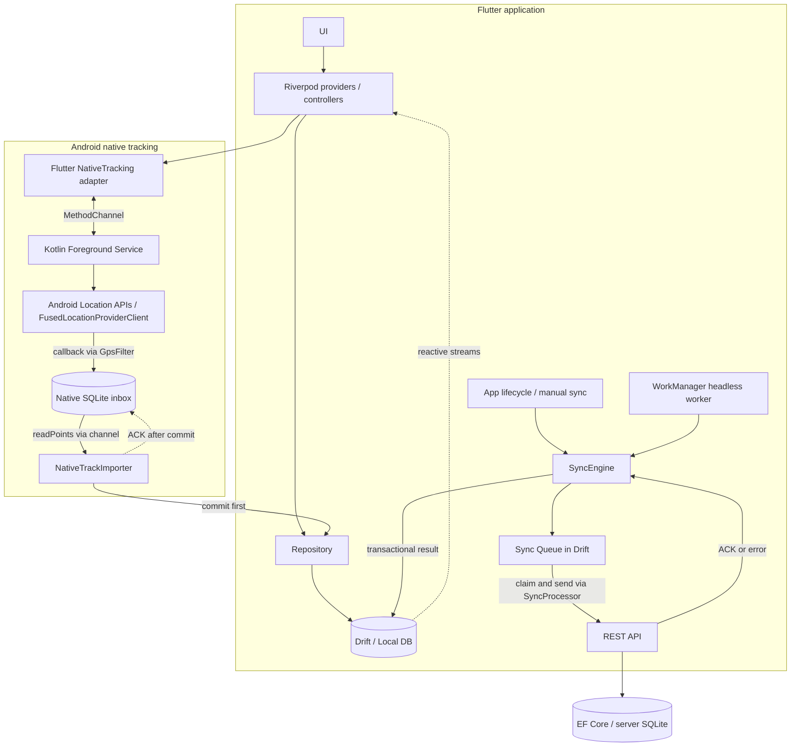

# Field Inspector

[](https://github.com/TrypikRU/workingwithmaps/actions/workflows/ci.yml)

Android-приложение на Flutter для выездного сотрудника: найти технический объект,
начать обход, подтвердить посещение по GPS и сохранить пройденный маршрут.
Объекты, визиты и очередь изменений доступны без интернета; отправка на сервер
выполняется отдельно от работы пользователя.

Pet-проект исследует практические задачи мобильной разработки: локальные
транзакции, потерю сети и подтверждений, конфликты версий, Android lifecycle и
сохранение GPS без Flutter UI. Минимальный ASP.NET Core backend служит тестовым стендом.

## Features

| Возможность | Реализация |
| --- | --- |
| **OpenStreetMap** | `flutter_map`: объекты со статусами и приоритетами, полигоны, GPS, polyline, camera bounds и возврат камеры к объектам/маршруту |
| **GPS** | Текущая и последняя известная позиция, accuracy, поток обновлений, permission denied/deniedForever, выключенная геолокация и ошибки |
| **Check-in** | Расстояние по собственному Haversine; радиус 50 м и accuracy ≤ 50 м; визит, очередь и статус visited сохраняются атомарно |
| **Offline-first / Drift** | SQLite — источник состояния экранов; reactive streams, начальный seed, схема v6 и проверяемые миграции |
| **SyncEngine** | Последовательная очередь, retry/backoff, идемпотентность, recovery, конфликты и диагностика |
| **Foreground tracking** | Kotlin location Foreground Service, постоянное уведомление, независимая запись GPS в native SQLite inbox |
| **WorkManager** | Отложенная отправка очереди при подключённой сети через тот же SyncEngine |
| **Geofence** | CircularGeofence: inside / approaching / outside; по умолчанию 50 / 150 м, информационное сообщение о приближении |
| **Point in Polygon** | Собственный Ray Casting: простые локальные полигоны, граница считается внутри; полигоны хранятся локально и отображаются на карте |
| **GPS filtering** | Отбрасывание неточных fixes, слишком малого движения, неверного времени и нереалистичной расчётной скорости |
| **Route tracking** | Начать/завершить обход, длительность, число точек, расстояние, посещённые объекты, восстановление активного обхода |
| **Marker clustering** | Собственная сеточная группировка Web Mercator O(n), кэширование слоёв; тест на 500 локальных объектах |
| **Offline maps** | Загрузка небольшого подготовленного raster-пакета, сохранённые тайлы и online fallback вне покрытия |

Автоматического Check-in и построения оптимального маршрута обхода нет.
Круговая зона и Point in Polygon — отдельные геометрические инструменты;
полигоны не подменяют проверку радиуса Check-in.

## Architecture

Feature-first структура. Основной путь чтения и локальных изменений:

```text
UI → Riverpod → Repository → Drift / Local DB
```

Путь исходящей синхронизации:

```text
SyncEngine → Sync Queue → REST API
```

Очередь хранится в Drift, а HTTP выполняет SyncProcessor. Ответ сервера сначала
фиксируется в SQLite; экраны получают обновление через stream локальной БД.



Ветвь платформы соответствует `Flutter ↔ MethodChannel ↔ Kotlin Foreground Service
→ Android Location APIs`. Управление сервисом и перенос точек не требуют связи
с Widget lifecycle. При отсутствии Flutter сервис пишет в собственный inbox.

```text
lib/
  app/                       # MaterialApp.router, go_router, тема
  core/
    database/                # Drift, служебные таблицы, миграции
    geometry/                # Haversine, geofence, Ray Casting
    location/                # LocationService, geolocator, native channel
    network/                 # Dio и mapping сетевых ошибок
    sync/                    # engine, processor, retry, lease, conflicts, worker
    permissions/ utils/ widgets/
  features/
    map/ objects/ route/ visits/ tracking/ sync/
      data/ domain/ presentation/  # слои по потребности feature
android/app/src/main/kotlin/  # Android service, native storage, GPS filter
backend/                     # ASP.NET Core API и HTTP smoke-тесты
test/                        # unit, SQLite integration, widget и HTTP tests
```

UI работает с доменными сущностями и состоянием Riverpod. SQL, Dio DTO и типы
`Geolocator.Position` остаются за границами экранов. Providers собирают зависимости;
GetIt/BLoC и дополнительный DI-контейнер не используются.

## Offline-first

**Local DB = source of truth.** Экран не переключается между «ответом API» и
«локальным cache»: карта, список и детали всегда читают один repository stream.

Например, Check-in выполняет одну транзакцию:

```text
BEGIN
  INSERT visit (syncStatus = pending)
  INSERT sync_queue operation
  UPDATE object SET status = visited
COMMIT
```

После commit UI сразу показывает посещение. Если вставка очереди не удалась,
откатывается и визит: нет сохранённой бизнес-операции без задания на синхронизацию.
Сеть на этом пути не вызывается. После повторного открытия приложения SQLite
содержит тот же визит, статус объекта и очередь.

Ручное обновление объектов идёт в обратном направлении:
`API → DTO/mapper → Repository → Drift transaction → stream → UI`.
Несинхронизированные изменения защищены от перезаписи, известная `serverVersion`
не откатывается более старым ответом. При offline/timeout/500 показывается SnackBar,
а локальные данные остаются на экране. При первом запуске пустая БД получает пять
demo-объектов; открытие приложения не требует доступного backend.

Бизнес-БД содержит `objects`, `routes`, `route_objects`, `visits`, `location_points`,
`sync_queue`, `sync_conflicts`, `app_metadata`. Снимки схем v1–v6 и migration tests
хранятся в репозитории. Несинхронизированная БД не удаляется ради обновления схемы.

## SyncEngine

Движок не зависит от UI и используется foreground lifecycle, экраном диагностики
и WorkManager. Запуск в открытом приложении происходит при старте/resume и по
таймеру; ручные действия доступны на вкладке «Синхронизация».

| Механизм | Поведение |
| --- | --- |
| **Queue** | Операции обрабатываются последовательно. Retry/conflict блокирует следующие операции своей сущности, но не другие сущности |
| **Durable claim** | Перед HTTP транзакционно сохраняются operationId, неизменяемый payload и syncing; HTTP выполняется вне SQLite-транзакции |
| **Success** | Проверенный ACK обновляет syncStatus/serverVersion и удаляет queue item одной транзакцией |
| **Retry** | Ошибка увеличивает attemptCount; lastError и nextRetryAt сохраняются на диск. Network, timeout и 5xx повторяются автоматически |
| **Exponential backoff** | 5, 10, 20, 40… секунд, максимум 15 минут на операцию. 4xx отделены от retryable ошибок; 409 требует решения конфликта |
| **Idempotency** | Клиент создаёт стабильный ID. Повтор сохраняет тот же payload/key; backend дедуплицирует immutable события по ID и payload, PATCH — по durable receipt |
| **Recovery** | Прерванные syncing возвращаются в pending с прежними ключом и payload; failed сохраняют backoff после restart |
| **Concurrency** | Single-flight в isolate плюс SQLite lease между UI и headless worker; проверка владельца защищает от запоздалого ACK старого worker |

Это **at-least-once доставка с идемпотентным применением**, а не обещание одного
HTTP-запроса: потеря ответа после серверного commit приводит к безопасному повтору.

**Конфликты.** PATCH с локальной версией 4 против серверной 5 получает 409.
В `sync_conflicts` сохраняются запрос, локальные и серверные поля. Диалог позволяет
явно принять серверную версию объекта или повторить последние локальные поля на
новой базе. Visit — факт события: автоматически затирать его на сервере нельзя.
История решений сохраняется; кнопка retry не обходит конфликт.

**Queue coalescing.** Повторные изменения объекта до первой отправки объединяются
в непрерывном неотправленном хвосте. Уже claimed A сохраняет payload, а новая B
ожидает своей очереди. ACK A обновляет версию, не затирая поля B. Для визитов и
GPS-точек coalescing не применяется.

[Подробности SyncEngine](lib/core/sync/README.md) ·
[Конфликты и сценарий A → B](lib/core/sync/CONFLICTS.md)

## Background processing

| | Foreground Service | WorkManager |
| --- | --- | --- |
| Задача | Продолжительный сбор GPS | Отложенная отправка pending/retry операций |
| Реализация | Kotlin, FusedLocationProviderClient | Headless Flutter worker, общий SyncEngine |
| Хранение | Независимый native SQLite inbox | Уже созданная Drift sync_queue |
| Запуск | Пользователь начинает обход из видимого приложения | Unique periodic work, connected network, battery not low |
| UI | Постоянное уведомление со счётчиком точек | Widget/Activity не требуются |

Native service не зависит от FlutterEngine. Импортёр читает точки через MethodChannel,
коммитит их вместе с sync_queue в Drift и только затем подтверждает native ACK.
Стабильные ID делают повторный импорт после сбоя безопасным.

**Граница MVP:** WorkManager не импортирует native inbox и не занимается GPS.
Накопленные при отсутствии Flutter точки начинают отправляться после импорта при
возвращении в приложение. Сбор координат при этом продолжает работать отдельно.

Период WorkManager — 15 минут, но это не точное расписание. Foreground Service
также не обещает непрерывность после force-stop, перезагрузки или вмешательства
производителя устройства. Для location FGS объявлены тип и permissions; запуск
происходит из видимой Activity. Требования платформы описаны в
[Android documentation](https://developer.android.com/develop/background-work/services/fgs/service-types#location).

[Native tracking и ADB](lib/features/tracking/README.md) ·
[Worker, retry и reboot](lib/core/sync/BACKGROUND_SYNC.md)

## GPS filtering

`LocationPointFilter` — самостоятельный Dart domain service. Kotlin `GpsFilter`
применяет эквивалентные правила до записи native inbox.

| Проверка | Решение |
| --- | --- |
| Accuracy > 50 м | Отбросить точку |
| Расстояние до предыдущей принятой точки < 5 м | Отбросить GPS-шум/малое перемещение |
| Haversine distance / elapsed time > 15 м/с | Отбросить нереалистичный скачок для текущего профиля обхода |
| Невалидные координаты, accuracy/speed или неположительный интервал времени | Отбросить точку |

GPS-reported speed хранится, но не считается доказательством правдоподобного движения.
Фильтр сравнивает с последней **принятой** точкой: выброс не смещает baseline.
Разрывы записи хранятся сегментами, чтобы polyline не соединяла неизвестные промежутки.
Пороги — параметры MVP, а не универсальная модель для транспорта любого типа.

## Offline maps

**Offline business data и offline map tiles — разные механизмы.** Отсутствие
подложки карты не лишает пользователя объектов, визитов и маршрута в Drift.

Для MVP выбран регион ЖД вокзал / Коммунистическая, 88 в Сыктывкаре: 40 PNG-тайлов, zoom 13–16.
Python-утилита конвертирует разрешённый raster MBTiles в небольшой JSON/PNG-пакет.
Приложение скачивает готовый пакет с собственного сервера, проверяет полноту,
формат и лимиты, затем устанавливает его в отдельный каталог.

Сохранённый тайл используется первым; при отсутствии тайла допускается online OSM
fallback. В режиме «Только offline-тайлы» сетевых запросов нет. Вне покрытия без
сети подложка может быть пустой. Пакет ограничен 12 MiB JSON / 8 MiB PNG и не
включён в репозиторий: требуется источник с правом offline-использования.

Массовое скачивание публичных OSM tiles не реализовано и запрещено
[политикой tile.openstreetmap.org](https://operations.osmfoundation.org/policies/tiles/).
[Подготовка пакета, локальный сервер и проверка](docs/OFFLINE_MAPS.md).

## Tech stack

| Область | Технологии |
| --- | --- |
| Mobile | Flutter 3.47.5 / Dart 3.13.4, Android-only |
| State / navigation | Riverpod, go_router |
| Storage / models | Drift 2.35.0, SQLite, Freezed, json_serializable, build_runner |
| Network / maps | Dio, flutter_map, OpenStreetMap, latlong2 |
| Location / background | geolocator, workmanager, Kotlin, MethodChannel, FusedLocationProviderClient |
| Backend | ASP.NET Core Web API, .NET 10, EF Core SQLite, Swagger |
| Quality | flutter_test, Kotlin JUnit, HTTP smoke tests, Python unittest, GitHub Actions |

Clustering и геометрические алгоритмы реализованы в проекте без дополнительного
geometry/clustering пакета. Версии зависимостей зафиксированы в lock-файлах.

## Screenshots

Места для реальных скриншотов подготовлены; изображения ещё не добавлены.

| Map | Object | Current Route | Sync |
| --- | --- | --- | --- |
| Карта, кластеры, GPS и трек | Расстояние, accuracy, Check-in | Длительность, точки и визиты | Очередь, retry и конфликт |
| `map.png` | `object.png` | `current-route.png` | `sync.png` |

[Каталог и инструкция съёмки](docs/screenshots/README.md).

## How to run

Demo-объекты и offline-регион расположены в Сыктывкаре возле ЖД вокзала,
ориентир — Коммунистическая, 88. Это синтетические объекты и границы.
При открытии старой локальной БД прежние demo-адреса и координаты переносятся
без очистки данных. Пользовательская геометрия и объекты с операциями в очереди
не перезаписываются; сначала синхронизируйте/разрешите их изменения.
Визиты и GPS-история сохраняют исходные координаты. Backend переносит свой
старый seed при перезапуске и увеличивает `serverVersion`, чтобы старый PATCH
обрабатывался как конфликт. После обновления backend обновите объекты в приложении.
Для offline-карты подготовьте новый пакет `syktyvkar-railway-v1`
по [инструкции](docs/OFFLINE_MAPS.md); прежний регион не используется.

Потребуются Flutter 3.47.5 stable, Android SDK, JDK 17, .NET 10 SDK; для native GPS —
Android device/emulator с Google Play Services / Google APIs. Для smoke-скрипта нужен
PowerShell 7.5+; Python 3 нужен только для подготовки/проверки offline-пакета.

### Flutter

```sh
git clone https://github.com/TrypikRU/workingwithmaps.git
cd workingwithmaps
flutter pub get
dart run build_runner build
flutter devices
flutter run -d <android-device-id> --dart-define=API_BASE_URL=http://10.0.2.2:5080/
```

`API_BASE_URL` по умолчанию уже указывает на emulator host. Без backend доступны
локальный seed, Check-in и обход. Для серверного обновления нажмите refresh на
карте или в списке объектов. Package name: `workingwithmaps`;
Android applicationId: `com.klochkov.workingwithmaps`.

Android-сборка использует AGP 9.0.1, Gradle 9.1 и встроенный Kotlin
(`android.builtInKotlin=true`). Kotlin 2.3.20 объявлен с `apply false`, чтобы
обновить компилятор относительно встроенного в AGP 9.0 Kotlin 2.2.10;
отдельный Kotlin Android plugin к модулю приложения не применяется.
`android.newDsl=false` пока сохраняет совместимость DSL плагинов.

Flutter 3.47.5 может печатать предупреждение о KGP для `workmanager_android`
0.10.9: проверка Flutter ищет `apply plugin` регулярным выражением, включая
условную ветку для старых сборок. При включённом built-in Kotlin эта ветка
WorkManager не выполняется. Не исправляйте предупреждение изменением Pub Cache
или отключением проверки зависимостей; при обновлении Flutter/WorkManager
повторно проверяйте Android-сборку.

### ASP.NET Core backend

В другом терминале из корня репозитория:

```sh
dotnet restore backend/FieldInspector.Api --locked-mode
dotnet run --project backend/FieldInspector.Api --launch-profile http
```

Swagger: [localhost:5080/swagger](http://127.0.0.1:5080/swagger).
API создаёт отдельную серверную SQLite и seed. Профиль `http` включает Development
и debug-сбои. Backend — локальный стенд без authentication и deployment.

| Endpoint | Назначение |
| --- | --- |
| `GET /objects`, `GET /objects/{id}` | Объекты и серверный snapshot для конфликта |
| `PATCH /objects/{id}` | Обновление с serverVersion и Idempotency-Key |
| `GET /routes/today`, `POST /routes` | Тестовый список и регистрация локального обхода |
| `POST /visits`, `GET /visits/{id}` | Идемпотентная запись визита и snapshot |
| `POST /location/batch` | Приём GPS-точек |
| `GET /sync?since=<timestamp>` | Серверные изменения; автоматический pull в приложении пока не подключён |

Для проверки ошибок используйте query `?debug=500`, `?debug=409`,
`?debug=timeout`, `?debug=delay&delayMs=2000` или заголовок `X-Debug-Fault`.
[Контракты и примеры запросов](backend/README.md).

### Физический Android по USB

```sh
adb reverse tcp:5080 tcp:5080
flutter run -d <android-device-id> --dart-define=API_BASE_URL=http://127.0.0.1:5080/
```

В debug-сборке HTTP разрешён для `10.0.2.2`, `127.0.0.1`, `localhost`.
Для начала обхода выдайте точную геолокацию; уведомления позволяют видеть счётчик
нативного сервиса. Инструкции offline-пакета и GPS-эмуляции доступны по ссылкам выше.

## Testing

```sh
flutter analyze
flutter test
flutter build apk --debug
```

Unit-тесты покрывают Haversine, Point in Polygon, geofence, GPS filter, Check-in,
repositories, RetryPolicy, SyncEngine, конфликты и coalescing. Проверки Drift
используют реальные memory/file SQLite: commit/rollback, миграции, restart,
reactive streams и конкурирующие подключения. Widget-тесты проверяют детали,
Check-in allowed/denied, синхронизацию и сетевую ошибку при доступном cache.
Тайлы и GPS подменяются; тесты не скачивают публичную OSM-карту.

Сквозной offline-тест проходит цепочку:
`offline start → local objects → Check-in → visit + queue → close SQLite → reopen
→ данные сохранены → network restored → sync → synced`.

Для настоящего HTTP запустите backend на **отдельной тестовой БД**:

```sh
dotnet run --project backend/FieldInspector.Api --launch-profile http -- --Storage:Path ../.tmp/integration.sqlite
# В другом терминале:
flutter test --dart-define=SYNC_TEST_URL=http://127.0.0.1:5080/
pwsh -NoProfile -File backend/scripts/Smoke-Test.ps1 -BaseUrl http://127.0.0.1:5080
dotnet build backend/FieldInspector.Api --configuration Release
```

Smoke-тесты изменяют тестовые данные и проверяют API, idempotency, конфликты,
искусственные 500/409/timeout/delay. Это реальный backend test suite; отдельного
xUnit-проекта нет. Дополнительные локальные проверки:

```sh
python -m unittest discover -s tools/offline_maps -v
# Из android/; на Windows используйте .\gradlew.bat:
./gradlew :app:testDebugUnitTest
```

В обычном Flutter-запуске 152 теста и 3 opt-in HTTP-сценария; с `SYNC_TEST_URL`
запускаются все 155 сценариев. Результаты предыдущего аудита и его границы:
[Final review](docs/FINAL_REVIEW.md), [карта покрытия](docs/AUDIT.md).

### CI

[GitHub Actions](.github/workflows/ci.yml): все PR, push в `main`/`master`/`develop`
и ручной запуск. Flutter job проверяет format, code generation, analyze, tests и
debug APK. Backend job выполняет locked restore, Release build и HTTP smoke suite.
Deployment отсутствует; opt-in Flutter HTTP-тесты запускаются локально отдельно.

## Architecture decisions

1. **Локальное состояние едино.** UI не зависит от доступности API; DTO отделён от
   domain entity, чтение и ручной refresh имеют разные состояния.
2. **Transactional outbox.** Бизнес-изменение и очередь не могут сохраниться частично.
3. **Durable claim и idempotency.** Замороженный payload делает timeout/restart
   воспроизводимым, а серверные receipts защищают от повторного применения PATCH.
4. **Явное разрешение конфликтов.** serverVersion — подтверждённая версия, Visit —
   неизменяемый факт; автоматического last-write-wins нет.
5. **Один engine для UI и worker.** SQLite lease и fencing защищают общую очередь
   между Flutter engines; сетевой вызов не держит SQL-транзакцию.
6. **Native inbox вместо прямой записи Kotlin в Drift.** Сервис переживает отсутствие
   UI и не зависит от Dart-generated схемы; перенос подтверждается только после commit.
7. **Geometry вне UI.** Haversine, Ray Casting и GPS filter тестируются независимо;
   native-фильтр имеет собственные проверки эквивалентных правил.
8. **Бизнес-данные и тайлы разделены.** Замена/ошибка offline-пакета не затрагивает
   визиты; обновление GPS не требует пересоздавать все объектные markers.

### Scope and limitations

Проект предназначен для демонстрации инженерных решений, а не для эксплуатации
без дальнейшей работы. Нет автоматического pull через `GET /sync`, синхронизации
завершения обхода, редактора объектов в UI и оптимизации маршрута. Polygon/radius
пока локальные. Point in Polygon рассчитан на простые локальные кольца без holes;
проверка на 500 объектов не является benchmark на реальном устройстве.

Native inbox импортируется при доступном Flutter; история конфликтов и серверные
receipts пока без политики очистки. Backend использует упрощённое развитие схемы
EnsureCreated/additive upgrade. Force-stop/Doze/OEM, батарею и длительную GPS-запись
нужно проверять на физических устройствах. Реальные screenshots и картографический
пакет ещё предстоит добавить для законченной демонстрации.
